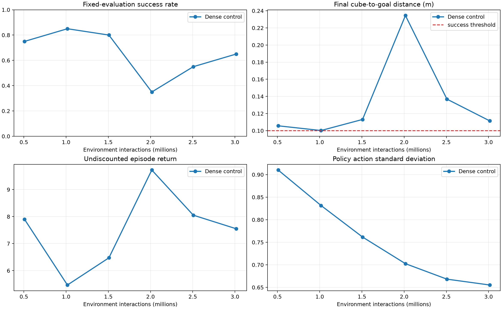
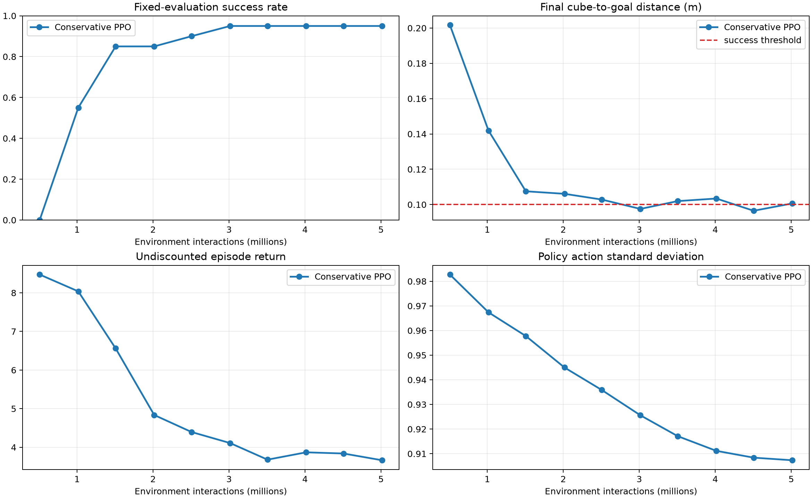
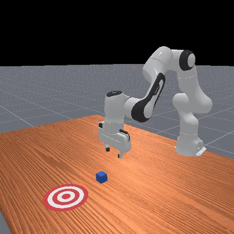

# PPO for ManiSkill PushCube

A reproducible study of how reward shaping and initial-state randomization affect PPO on ManiSkill's `PushCube-v1` task.

## Current status

The environment and official ManiSkill PPO pipeline have been validated locally. The official CUDA baseline for seed `9351` is complete and reaches 100% success on the fixed 20-episode deterministic evaluation. Its checkpoint and evaluation are kept as local experiment artifacts, outside Git.

The project now keeps that result as its reference run. The minimal custom PPO uses bounded Gaussian actions and passes its CPU integration run. The CUDA custom trainer now uses periodic fixed-seed checkpoint selection, learning-rate decay, and conservative PPO updates; its 5-million-step pilot reaches 95% success and remains at that level from 3M to 5M interactions. This is encouraging, but it is one training seed rather than a final comparison. Additional official seeds will be run only when assembling final aggregate results.

See [ROADMAP.md](ROADMAP.md) for the authoritative progress tracker and next steps.

## Quick start

The project targets Linux, an NVIDIA GPU, CUDA, and Python 3.12. The validated
machine has an NVIDIA GeForce RTX 3090 (24 GB VRAM), an AMD Ryzen 9 5950X
(16 cores / 32 threads), and 24 GB RAM; training uses ManiSkill's `physx_cuda` backend.
The fixed checkpoint evaluator intentionally uses CPU PhysX so its 20 seeded episodes
remain lightweight, deterministic, and independent of training throughput.

The project uses [uv](https://docs.astral.sh/uv/).

```bash
uv sync --frozen
uv run scripts/smoke_test.py
```

The smoke test checks a seeded CPU-simulator episode and video recording. Before a
CUDA training run, confirm that `nvidia-smi` works and that
`uv run python -c "import torch; assert torch.cuda.is_available()"` succeeds.

## Scope

- Task: `PushCube-v1` with Panda
- Observations: ground-truth `state`
- Reference controller: `pd_joint_delta_pos`
- Reference reward: ManiSkill `normalized_dense`
- Algorithm: PPO
- Episode horizon: 50 steps

Full training runs require Linux, NVIDIA CUDA, and ManiSkill's `physx_cuda` backend.

## Key commands

```bash
# Validate the official pipeline locally; this is not a performance run.
uv run scripts/run_official_baseline.py --profile cpu-smoke
uv run scripts/evaluate.py runs/official-ppo-cpu-smoke/final_ckpt.pt

# Run one full official baseline on Linux/NVIDIA.
uv run scripts/run_official_baseline.py --profile official --seed 9351

# Train the minimal custom PPO locally, then evaluate it with the shared evaluator.
uv run scripts/train_custom_ppo.py
uv run scripts/evaluate.py runs/custom-ppo-cpu/final_ckpt.pt --no-video

# Run the vectorized CUDA custom PPO on Linux/NVIDIA (long training run).
uv run scripts/train_custom_ppo.py \
  --config configs/custom_ppo_cuda.json \
  --output-dir runs/custom-ppo-cuda-9351
uv run scripts/evaluate.py runs/custom-ppo-cuda-9351/final_ckpt.pt

# First CUDA learning check (~1 minute on the validated RTX 3090 setup).
uv run scripts/train_custom_ppo.py \
  --config configs/custom_ppo_cuda.json \
  --total-timesteps 500000 \
  --output-dir runs/custom-ppo-cuda-500k

# Conservative PPO stability test (5M interactions).
uv run scripts/train_custom_ppo.py \
  --config configs/custom_ppo_cuda_conservative.json \
  --output-dir runs/custom-ppo-cuda-conservative-5M
```

The CUDA configuration saves and evaluates a checkpoint every 500,000 requested
interactions on the fixed 20 CPU evaluation seeds. It keeps the selected model at
`runs/<run>/checkpoints/best_ckpt.pt`; `checkpoint_metrics.json` records success,
return, final distance, KL, clipping, losses, entropy, and action standard deviation.

## 3M reward-alignment pilot

We compared the stabilized dense-reward control with a transparent time cost of
`-0.01` per environment step. Both selected checkpoints reach **85% success** on
the same 20 deterministic evaluation seeds. The time-cost condition is more stable
at the end of its run (85% versus 65%), but it does **not** yet make successful
episodes shorter: its selected policy needs 30.7 steps on average, compared with
15.6 for the control. It should therefore be treated as a promising stability
ablation—not as a confirmed improvement in efficiency—until it is repeated across
three training seeds.


For the dense-reward control alone, the full checkpoint evolution is also available:



The reusable plotting command is:

```bash
uv run scripts/plot_checkpoints.py \
  runs/custom-ppo-cuda-stabilized-3M-control/checkpoint_metrics.json \
  runs/custom-ppo-cuda-time-penalty-3M/checkpoint_metrics.json \
  --labels "Standard reward" "Time penalty (-0.01/step)" \
  --output docs/images/custom_ppo_time_penalty_3m.png
```

The shared evaluator also records representative MP4 videos locally under
`artifacts/evaluations/<run>/videos/` (experiment artifacts are deliberately not
committed). See [the pilot report](docs/RESULTS.md) for the exact measurements and
interpretation.

## Conservative PPO 5M pilot

The dense reward is retained. To make PPO updates less destructive, this run uses
an initial learning rate of `1e-4`, `target_kl=0.03`, and two update epochs (instead
of `3e-4`, `0.10`, and four). On the fixed 20-seed evaluator it reaches **95%
(19/20) success at 3.01M** and keeps 95% through 5.01M interactions. The selected
checkpoint is at 4.51M; an independent full evaluation confirms 95% success,
13.1 steps to success, and 0.0948 m final distance. This is a combined stability
test, so it cannot attribute the improvement to one hyperparameter or establish a
multi-seed conclusion.



[](docs/videos/custom_ppo_conservative_5m_best.mp4)

_Representative deterministic rollout from the selected 5M checkpoint. Click the
preview to open the MP4._

## Documentation

- [Roadmap](ROADMAP.md): current status, milestones, and completion criteria
- [Custom PPO CPU configuration](configs/custom_ppo_cpu.json): short local training run
- [Custom PPO CUDA configuration](configs/custom_ppo_cuda.json): vectorized matched-budget run
- [Conservative CUDA configuration](configs/custom_ppo_cuda_conservative.json): selected 5M stability setting
- [Time-cost reward configuration](configs/custom_ppo_cuda_time_penalty.json): 3M reward-alignment ablation
- [Pilot results](docs/RESULTS.md): 3M control versus time-cost comparison
- [PPO investigation log](docs/PPO_INVESTIGATION.md): hypotheses, configurations, observations, and conclusions
- [Experiment plan](docs/EXPERIMENT_PLAN.md): frozen comparison protocol and metrics
- [Official baseline](docs/OFFICIAL_BASELINE.md): upstream provenance and parameters

## References

- [ManiSkill documentation](https://maniskill.readthedocs.io/en/latest/)
- [ManiSkill PPO baselines](https://github.com/haosulab/ManiSkill/tree/main/examples/baselines/ppo)
- [Proximal Policy Optimization Algorithms](https://arxiv.org/abs/1707.06347)
